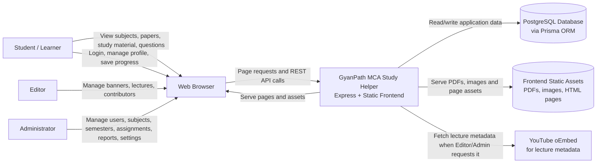

# Context Diagram / User-Based Diagram

## Explanation

This context diagram shows how the main users interact with the GyanPath MCA Study Helper system. The system serves study pages, question banks, previous-year papers, authentication, progress tracking, admin management and editable content APIs.

## Notes / Assumptions

- The application is currently an Express + TypeScript modular monolith that serves the frontend and REST APIs.
- Student-facing discussion and chat pages exist, but implemented backend routes for discussion and chat are not present in the current route registration.
- The Prisma schema includes `MODERATOR`, but current backend route guards mainly use `USER`, `EDITOR` and `ADMIN`.
- Redis, BullMQ and Socket.IO are present as foundations/dependencies, but the active documented flows are based on implemented REST routes.
