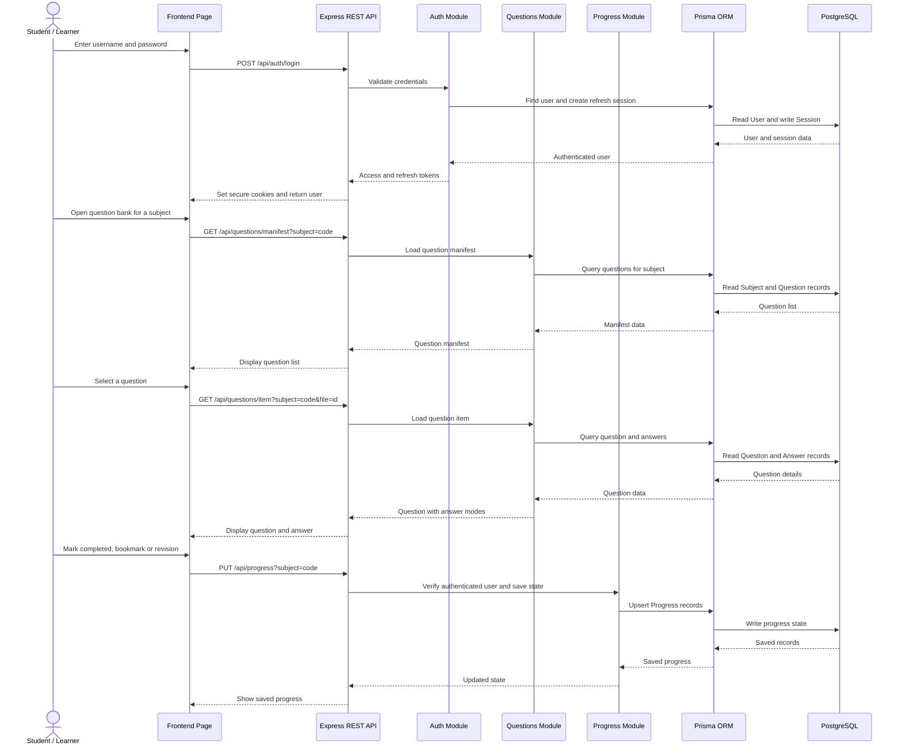

# UML Sequence Diagram

## Explanation

This sequence diagram shows a common implemented user flow: login, browse the question bank, open a question and save progress. It follows the frontend REST client, Express controllers/services/repositories, Prisma and PostgreSQL.

## Notes / Assumptions

- Authentication uses HTTP-only cookies named by the backend for access and refresh tokens.
- The frontend API client retries once through `/api/auth/refresh` when an authenticated request receives `401`.
- The diagram shows the database-backed flow; static resource pages and PDF viewing use served frontend assets in addition to API data.
